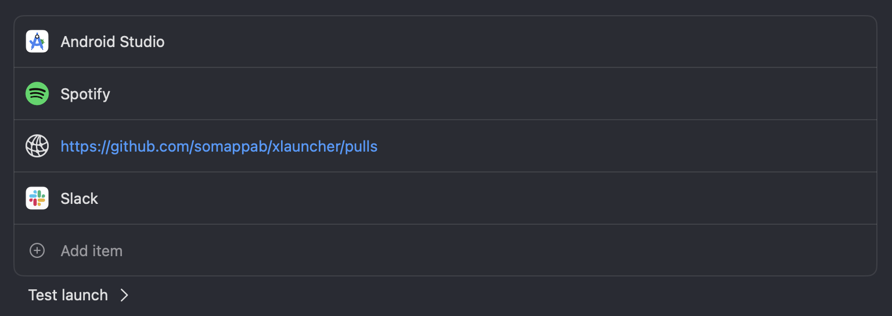
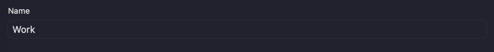
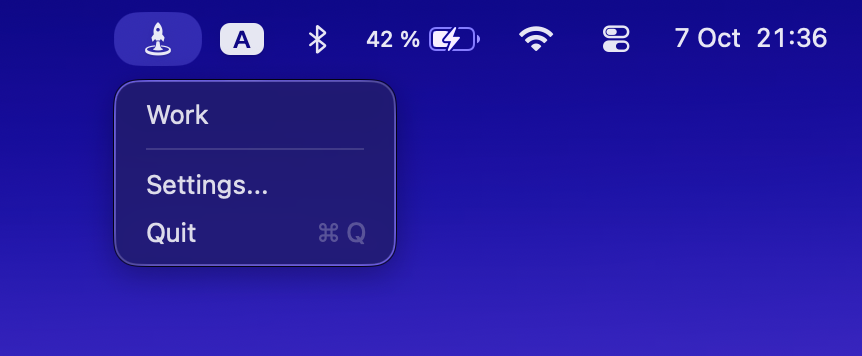
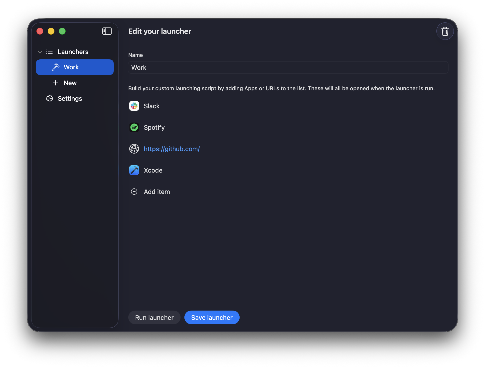

# SomLauncher
Launch all your workflows on macOS in one click with SomLauncher.

[Free on App Store](https://apps.apple.com/se/app/somlauncher/id6740208707)

More info at [somapplication.com/launcher](https://www.somapplication.com/launcher)

### How to use SomLauncher
1. Build your launcher


2. Name your launcher


3. Launch from the menu bar


4. Continue building all your workflows in SomLauncher



### Build notes
After adjusting the app icon dynamically (setIcon on macOS) the build might fail, because of "resource fork"

* Run command below in the project folder
  ```
  find . -type f -name '*.jpeg' -exec xattr -c {} \;
  find . -type f -name '*.jpg' -exec xattr -c {} \;
  find . -type f -name '*.png' -exec xattr -c {} \;
  find . -type f -name '*.json' -exec xattr -c {} \;
  ```
* Press Cmd+Option+Shift+K in Xcode to clean the build
* Run Cmd+R to run the app again, and it should work (Until setting the icon again)
